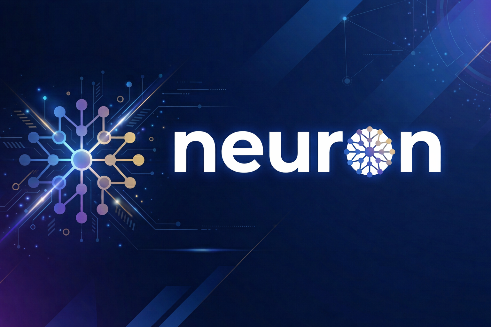

<p align="center">
  
</p>

# Neuron

AI 에이전트를 위한 선언적 웹 앱 DSL 컴파일러.

`.neuron` 파일을 작성하면 SPA(Single Page Application)로 컴파일합니다. 프레임워크 없이 순수 HTML/CSS/JS를 생성합니다.

## 설치

```bash
npm install -g neuron-dsl
```

## Quick Start

```bash
# 프로젝트 생성
neuron new my-shop

# 빌드
cd my-shop
neuron build
```

`dist/` 폴더의 결과물을 아무 정적 서버에 배포하면 됩니다:

```bash
# 로컬에서 바로 확인 (npx 활용)
npx serve dist
```

`dist/` 폴더에 배포 가능한 SPA가 생성됩니다:

```
dist/
├── index.html   ← 모든 페이지 포함 (SPA)
├── style.css    ← 테마 + 컴포넌트 스타일
├── main.js      ← 상태 + 라우터 + 컴포넌트 (Pure JS)
└── assets/
```

## 새 기능 (v2.0)

- **새 액션 패턴**: `set`, `toggle`, `increment`, `decrement`, `navigate`
- **외부 JS 로직**: `use: logic/file.function` — 복잡한 로직은 JS로
- **동적 라우팅**: `/product/:id` 스타일 파라미터
- **조건부 렌더링**: `show_if: state` / `show_if: !state`
- **폼 검증**: `type`, `required`, `min`, `max` 속성

### 런타임 품질 (v2.1)

- **페이지 트랜지션**: theme.json에서 `fade`/`slide` 설정
- **상태 영속성**: `STATE persist: field1, field2` — localStorage 자동 저장
- **반응형 레이아웃**: 모바일 자동 대응 (768px 이하)
- **로딩/에러 UI**: API 호출 시 자동 스피너 + 에러 표시

자세한 문법은 [REFERENCE.md](REFERENCE.md)를 참고하세요.

## DSL 문법

키워드는 4개뿐: `STATE` `ACTION` `API` `PAGE`

### 프로젝트 구조

```
my-shop/
├── app.neuron          ← STATE, ACTION 정의
├── pages/
│   ├── home.neuron
│   ├── cart.neuron
│   └── checkout.neuron
├── apis/
│   ├── products.neuron
│   └── orders.neuron
├── themes/
│   └── theme.json
├── assets/
└── neuron.json
```

### STATE & ACTION (app.neuron)

앱 전체의 상태와 액션을 정의합니다.

```
STATE
  cart: []
  products: []
  user: null

---

ACTION add-to-cart
  append: product -> cart

ACTION remove-from-cart
  remove: cart where id matches

ACTION pay
  call: orders
  on_success: -> /complete
  on_error: show-error
```

### PAGE (pages/*.neuron)

페이지 하나당 파일 하나. 컴포넌트를 들여쓰기로 배치합니다.

```
PAGE home "홈" /

  header
    title: "My Shop"
    links: [상품>/products, 장바구니>/cart]

  hero
    title: "최고의 쇼핑"
    subtitle: "지금 시작하세요"
    cta: "쇼핑하기" -> /products

  product-grid
    data: products
    cols: 3
    on_click: add-to-cart

  footer
    text: "© 2026 My Shop"
```

인라인 단축 문법도 지원합니다:

```
  button "결제하기" -> /checkout
    variant: primary
```

### API (apis/*.neuron)

```
API products
  GET /api/products
  on_load: true
  returns: Product[]

API orders
  POST /api/orders
  body: cart
  returns: Order
```

## 빌트인 컴포넌트

### 레이아웃

| 타입 | 설명 | 주요 속성 |
|------|------|----------|
| header | 상단 네비게이션 | title, logo, links |
| footer | 하단 푸터 | text |
| section | 컨테이너 | - |
| grid | 그리드 레이아웃 | cols |
| hero | 풀와이드 배너 | title, subtitle, cta |

### 데이터 표시

| 타입 | 설명 | 주요 속성 |
|------|------|----------|
| product-grid | 상품 목록 그리드 | data, cols, on_click |
| list | 범용 리스트 | data, template |
| table | 테이블 | data, cols |
| text | 텍스트 | content, size |
| image | 이미지 | src, alt |

### 상태 연동

| 타입 | 설명 | 주요 속성 |
|------|------|----------|
| cart-icon | 장바구니 아이콘+뱃지 | state, act |
| cart-summary | 장바구니 합계 | state |
| cart-list | 장바구니 목록 | state, on_remove |

### 인터랙션

| 타입 | 설명 | 주요 속성 |
|------|------|----------|
| button | 버튼 | label, act, variant |
| form | 폼 | fields, submit |
| search | 검색창 | placeholder, state, on_change |
| tabs | 탭 | items |
| modal | 모달 | state, title |

## 테마 시스템

`themes/theme.json`으로 색상, 폰트, 간격을 관리합니다. `.neuron`에서는 variant만 지정합니다.

```json
{
  "colors": {
    "primary": "#2E86AB",
    "secondary": "#A23B72",
    "danger": "#E84855",
    "bg": "#FFFFFF",
    "text": "#1A1A2E",
    "border": "#E0E0E0"
  },
  "font": {
    "family": "Inter",
    "size": { "sm": 14, "md": 16, "lg": 20, "xl": 28 }
  },
  "radius": 8,
  "shadow": "0 2px 8px rgba(0,0,0,0.1)",
  "spacing": { "sm": 8, "md": 16, "lg": 24, "xl": 48 }
}
```

variant 종류: `primary` | `secondary` | `danger` | `ghost`

## 컴파일러 출력

`neuron build`는 Svelte 방식으로 컴파일 타임에 상태-DOM 바인딩을 확정합니다:

```javascript
// 상태 초기화
const _state = { cart: [], products: [] }

// 상태-DOM 바인딩
const _bindings = {
  cart: [_update_cart_icon, _update_cart_list, _update_cart_summary],
  products: [_update_product_grid]
}

// 상태 변경 → 바인딩된 DOM만 업데이트
function _setState(key, val) {
  _state[key] = val
  _bindings[key]?.forEach(fn => fn(val))
}
```

## 에러 메시지

AI가 이해할 수 있는 명확한 에러를 출력합니다:

```
[NEURON ERROR] 알 수 없는 컴포넌트: "buttton"
→ 사용 가능: button, form, text, image, header, footer ...

[NEURON ERROR] state "wishlist" 가 정의되지 않음
→ app.neuron STATE 섹션에 "wishlist: []" 를 추가하세요
```

## 개발

```bash
# 의존성 설치
npm install

# 테스트
npm test

# 빌드
npm run build
```

## 아키텍처

```
.neuron 소스 → Lexer(토큰화) → Parser(AST) → Generator(HTML/CSS/JS) → dist/
```

| 모듈 | 파일 | 역할 |
|------|------|------|
| Lexer | `src/lexer.ts` | 소스 → 토큰 |
| Parser | `src/parser.ts` | 토큰 → AST |
| HTML Generator | `src/generator/html.ts` | 페이지 → HTML |
| CSS Generator | `src/generator/css.ts` | 테마 → CSS |
| JS Generator | `src/generator/js.ts` | 상태/라우터/액션 → JS |
| Component Registry | `src/components/registry.ts` | 컴포넌트 → HTML 렌더러 |
| Compiler | `src/compiler.ts` | 파이프라인 오케스트레이션 |
| CLI | `src/cli.ts` | 명령어 인터페이스 |

## 철학

`.neuron` 파일은 AI 에이전트가 읽고 쓰는 파일입니다. 사람이 읽을 필요 없습니다. 컴파일러가 읽을 수 있으면 됩니다. 포맷은 LLM이 가장 정확하게 생성할 수 있는 구조를 우선합니다.

## License

MIT
